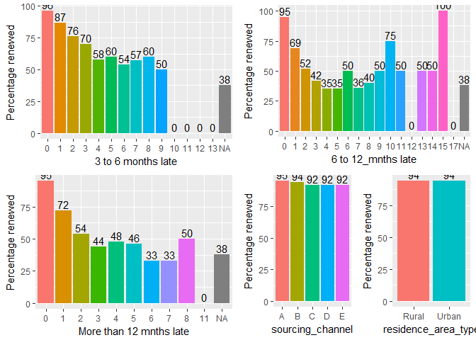
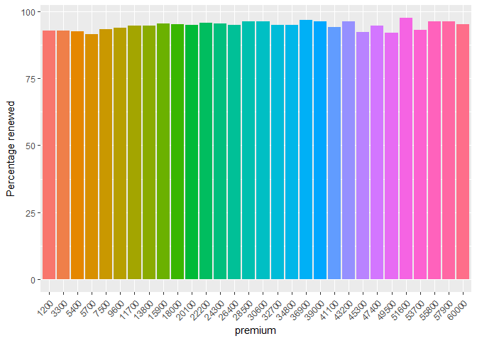
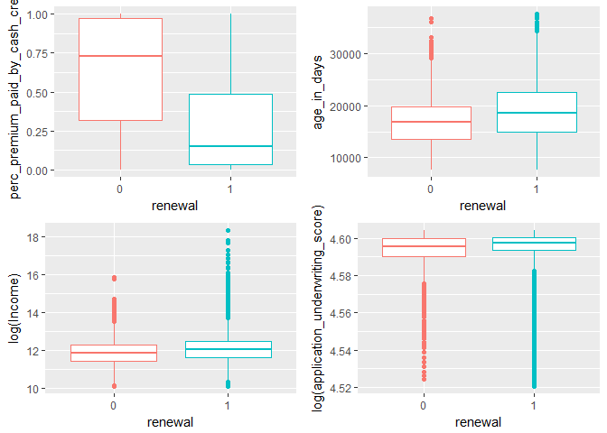
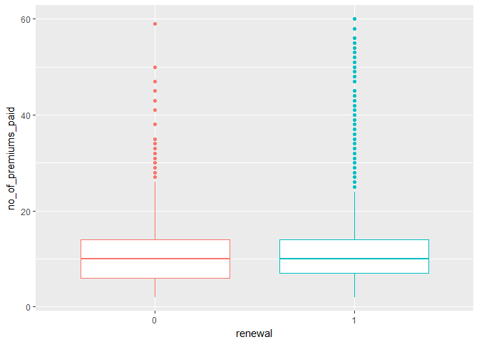
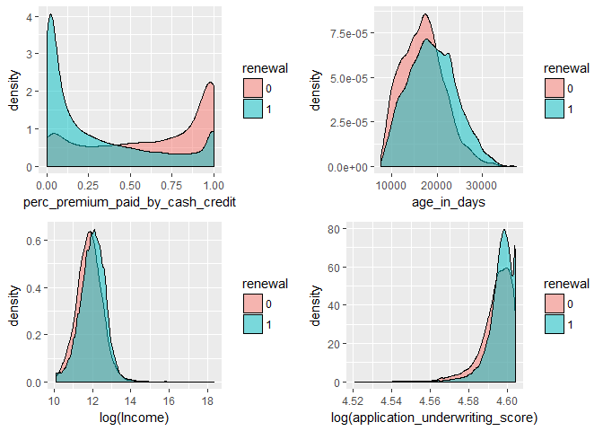
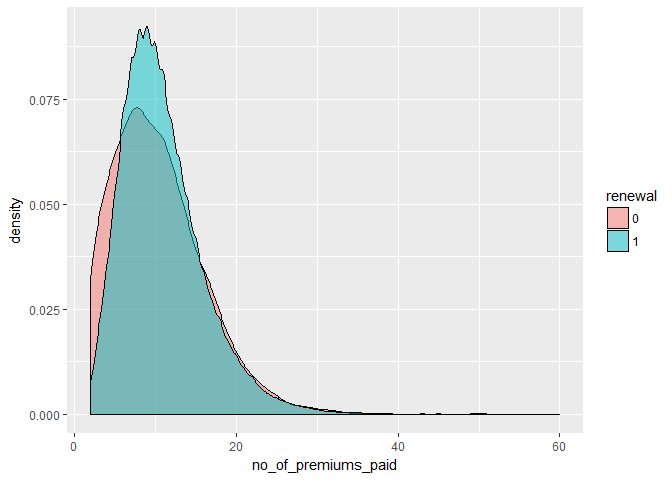

McKinsey\_EDA
================
Vikas\_Jha(<vikasjhanitk@gmail.com>)
July 20, 2018

``` r
multiplot <- function(..., plotlist=NULL, file, cols=1, layout=NULL) {
  require(grid)

  # Make a list from the ... arguments and plotlist
  plots <- c(list(...), plotlist)

  numPlots = length(plots)

  # If layout is NULL, then use 'cols' to determine layout
  if (is.null(layout)) {
    # Make the panel
    # ncol: Number of columns of plots
    # nrow: Number of rows needed, calculated from # of cols
    layout <- matrix(seq(1, cols * ceiling(numPlots/cols)),
                    ncol = cols, nrow = ceiling(numPlots/cols))
  }

 if (numPlots==1) {
    print(plots[[1]])

  } else {
    # Set up the page
    grid.newpage()
    pushViewport(viewport(layout = grid.layout(nrow(layout), ncol(layout))))

    # Make each plot, in the correct location
    for (i in 1:numPlots) {
      # Get the i,j matrix positions of the regions that contain this subplot
      matchidx <- as.data.frame(which(layout == i, arr.ind = TRUE))

      print(plots[[i]], vp = viewport(layout.pos.row = matchidx$row,
                                      layout.pos.col = matchidx$col))
    }
  }
}
```

Introduction
============

This Exploratory Data Analysis on dataset of Mckinsey Hackathon '<https://datahack.analyticsvidhya.com/contest/mckinsey-analytics-online-hackathon-4/>'. The hackathon's goal is to solve the issues for an Insurance company, by developing a model, in order to: 1. Predect the propensity to pay renewal premium. 2. Build an incentive plan for its agents to maximise the net revenue (i.e. renewals - incentives given to collect the renewals) collected from the policies post their issuance.

Information available is about past transactions from the policy holders along with their demographics. The client has provided aggregated historical transactional data like number of premiums delayed by 3/ 6/ 12 months across all the products, number of premiums paid, customer sourcing channel and customer demographics like age, monthly income and area type. Further, following extra data has been made available: 1. Expected effort in hours put in by an agent for incentives provided. 2. Expected increase in chances of renewal, given the effort from the agent.

Evaluation Criteria:
====================

There are two criteria: (a) The base probability of receiving a premium on a policy without considering any incentive, to be evaluated using AUC ROC score (b) The monthly incentives you will provide on each policy to maximize the net revenue, scored as:


-pbenchmark is the renewal probability predicted using a benchmark model by the insurance company. -???p (% Improvement in renewal probability\*pbenchmark) is the improvement in renewal probability calculated from the agent efforts in hours. -'Premium on policy' is the premium paid by the policy holder for the policy in consideration. -'Incentive on policy' is the incentive given to the agent for increasing the chance of renewal (estimated by the participant) for each policy

The following curve provide the relationship between extra effort in hours invested by the agent with Incentive to the agent and % improvement in renewal probability vs agent effort in hours: 1. Relationship b/w Extra efforts in hours invested by an agent and Incentive to agent. After a point more incentives does not convert to extra efforts. 

Equation for the effort-incentives curve: Y = 10\*(1-exp(-X/400))

1.  Relationship between % improvement in renewal probability vs Agent effort in hours. The renewal probability cannot be improved beyond a certain level even with more efforts. 

Equation for the % improvement in renewal prob vs effort curve: Y = 20\*(1-exp(-X/5)

Combined Score = w1*AUC-ROC value + w2*(net revenue collected from all policies)\*lambda where - w1 = 0.7 w2 = 0.3 lambda is a normalizing factor

-------Setting up working directory and list files---------------
-----------------------------------------------------------------

``` r
#setwd("D:/Kaggle/Analyticsvaidya/Mckinsay/")
#all_files <- list.files("../input/")
```

-------Loading packages------------------------------------------
-----------------------------------------------------------------

``` r
# general data manipulation
library(data.table) ## data manipulation
library(dplyr) ## data manipulation
```

    ## Warning: package 'dplyr' was built under R version 3.4.3

    ## 
    ## Attaching package: 'dplyr'

    ## The following objects are masked from 'package:data.table':
    ## 
    ##     between, first, last

    ## The following objects are masked from 'package:stats':
    ## 
    ##     filter, lag

    ## The following objects are masked from 'package:base':
    ## 
    ##     intersect, setdiff, setequal, union

``` r
# general visualisation
library(ggplot2) # visualisation
```

    ## Warning: package 'ggplot2' was built under R version 3.4.4

``` r
library(scales) # visualisation
```

    ## Warning: package 'scales' was built under R version 3.4.1

``` r
library(scales) # visualisation
library(corrplot) # visualisation
```

    ## Warning: package 'corrplot' was built under R version 3.4.3

    ## corrplot 0.84 loaded

``` r
library(reshape2)
```

    ## Warning: package 'reshape2' was built under R version 3.4.1

    ## 
    ## Attaching package: 'reshape2'

    ## The following objects are masked from 'package:data.table':
    ## 
    ##     dcast, melt

``` r
library(knitr)
```

    ## Warning: package 'knitr' was built under R version 3.4.1

-------Load data---------------------------------------------------
-------------------------------------------------------------------

``` r
d_train <- fread("D:/Kaggle/Analyticsvaidya/Mckinsay/input/train.csv", stringsAsFactors = F, na.strings = c(""," ", "NA"))
d_test <- fread("D:/Kaggle/Analyticsvaidya/Mckinsay/input/test.csv", stringsAsFactors = F, na.strings = c("", " ", "NA"))
sample_sub <- fread("D:/Kaggle/Analyticsvaidya/Mckinsay/input/sample_submission.csv", stringsAsFactors = F)
```

-------Changing file names according to R----------------------------
---------------------------------------------------------------------

``` r
names(d_train) <- sub("-", "_", names(d_train))
names(d_test) <- sub("-", "_", names(d_test))
```

-------Overview: File structure and content-------------------------
--------------------------------------------------------------------

``` r
summary(d_train)
```

    ##        id         perc_premium_paid_by_cash_credit  age_in_days   
    ##  Min.   :     2   Min.   :0.0000                   Min.   : 7670  
    ##  1st Qu.: 28640   1st Qu.:0.0340                   1st Qu.:14974  
    ##  Median : 57262   Median :0.1670                   Median :18625  
    ##  Mean   : 57167   Mean   :0.3143                   Mean   :18847  
    ##  3rd Qu.: 85632   3rd Qu.:0.5380                   3rd Qu.:22636  
    ##  Max.   :114076   Max.   :1.0000                   Max.   :37602  
    ##                                                                   
    ##      Income         Count_3_6_months_late Count_6_12_months_late
    ##  Min.   :   24030   Min.   : 0.0000       Min.   : 0.00000      
    ##  1st Qu.:  108010   1st Qu.: 0.0000       1st Qu.: 0.00000      
    ##  Median :  166560   Median : 0.0000       Median : 0.00000      
    ##  Mean   :  208847   Mean   : 0.2487       Mean   : 0.07819      
    ##  3rd Qu.:  252090   3rd Qu.: 0.0000       3rd Qu.: 0.00000      
    ##  Max.   :90262600   Max.   :13.0000       Max.   :17.00000      
    ##                     NA's   :97            NA's   :97            
    ##  Count_more_than_12_months_late application_underwriting_score
    ##  Min.   : 0.00000               Min.   :91.90                 
    ##  1st Qu.: 0.00000               1st Qu.:98.81                 
    ##  Median : 0.00000               Median :99.21                 
    ##  Mean   : 0.06001               Mean   :99.07                 
    ##  3rd Qu.: 0.00000               3rd Qu.:99.54                 
    ##  Max.   :11.00000               Max.   :99.89                 
    ##  NA's   :97                     NA's   :2974                  
    ##  no_of_premiums_paid sourcing_channel   residence_area_type
    ##  Min.   : 2.00       Length:79853       Length:79853       
    ##  1st Qu.: 7.00       Class :character   Class :character   
    ##  Median :10.00       Mode  :character   Mode  :character   
    ##  Mean   :10.86                                             
    ##  3rd Qu.:14.00                                             
    ##  Max.   :60.00                                             
    ##                                                            
    ##     premium         renewal      
    ##  Min.   : 1200   Min.   :0.0000  
    ##  1st Qu.: 5400   1st Qu.:1.0000  
    ##  Median : 7500   Median :1.0000  
    ##  Mean   :10925   Mean   :0.9374  
    ##  3rd Qu.:13800   3rd Qu.:1.0000  
    ##  Max.   :60000   Max.   :1.0000  
    ## 

``` r
glimpse(d_train)
```

    ## Observations: 79,853
    ## Variables: 13
    ## $ id                               <int> 110936, 41492, 31300, 19415, ...
    ## $ perc_premium_paid_by_cash_credit <dbl> 0.429, 0.010, 0.917, 0.049, 0...
    ## $ age_in_days                      <int> 12058, 21546, 17531, 15341, 3...
    ## $ Income                           <int> 355060, 315150, 84140, 250510...
    ## $ Count_3_6_months_late            <int> 0, 0, 2, 0, 0, 2, 0, 1, 0, 2,...
    ## $ Count_6_12_months_late           <int> 0, 0, 3, 0, 0, 0, 0, 6, 0, 0,...
    ## $ Count_more_than_12_months_late   <int> 0, 0, 1, 0, 0, 0, 0, 4, 0, 0,...
    ## $ application_underwriting_score   <dbl> 99.02, 99.89, 98.69, 99.57, 9...
    ## $ no_of_premiums_paid              <int> 13, 21, 7, 9, 12, 9, 11, 3, 4...
    ## $ sourcing_channel                 <chr> "C", "A", "C", "A", "B", "B",...
    ## $ residence_area_type              <chr> "Urban", "Urban", "Rural", "U...
    ## $ premium                          <int> 3300, 18000, 3300, 9600, 9600...
    ## $ renewal                          <int> 1, 1, 0, 1, 1, 1, 1, 0, 1, 0,...

``` r
d_train %>% nrow()
```

    ## [1] 79853

``` r
d_train %>% distinct(id) %>% nrow()
```

    ## [1] 79853

``` r
missing_val <- data.frame(variable = names(d_test), train_val = 0, train_per = 0, test_val = 0, test_per = 0)

missing_val$train_val <- apply(d_train[,-13], 2, FUN = function(x) {sum(is.na(x))})
missing_val$train_per <- missing_val$train_val/nrow(d_train)*100

missing_val$test_val <- apply(d_test, 2, FUN = function(x) {sum(is.na(x))})
missing_val$test_per <- missing_val$test_val/nrow(d_train)*100
print(missing_val %>% kable())
```

    ## 
    ## 
    ## variable                            train_val   train_per   test_val    test_per
    ## ---------------------------------  ----------  ----------  ---------  ----------
    ## id                                          0   0.0000000          0   0.0000000
    ## perc_premium_paid_by_cash_credit            0   0.0000000          0   0.0000000
    ## age_in_days                                 0   0.0000000          0   0.0000000
    ## Income                                      0   0.0000000          0   0.0000000
    ## Count_3_6_months_late                      97   0.1214732         31   0.0388213
    ## Count_6_12_months_late                     97   0.1214732         31   0.0388213
    ## Count_more_than_12_months_late             97   0.1214732         31   0.0388213
    ## application_underwriting_score           2974   3.7243435       1323   1.6567944
    ## no_of_premiums_paid                         0   0.0000000          0   0.0000000
    ## sourcing_channel                            0   0.0000000          0   0.0000000
    ## residence_area_type                         0   0.0000000          0   0.0000000
    ## premium                                     0   0.0000000          0   0.0000000

``` r
summary(d_test)
```

    ##        id         perc_premium_paid_by_cash_credit  age_in_days   
    ##  Min.   :     1   Min.   :0.0000                   Min.   : 7671  
    ##  1st Qu.: 28255   1st Qu.:0.0340                   1st Qu.:14972  
    ##  Median : 56488   Median :0.1690                   Median :18623  
    ##  Mean   : 56740   Mean   :0.3145                   Mean   :18824  
    ##  3rd Qu.: 85386   3rd Qu.:0.5400                   3rd Qu.:22636  
    ##  Max.   :114077   Max.   :1.0000                   Max.   :35785  
    ##                                                                   
    ##      Income         Count_3_6_months_late Count_6_12_months_late
    ##  Min.   :   24030   Min.   : 0.0000       Min.   : 0.00000      
    ##  1st Qu.:  106398   1st Qu.: 0.0000       1st Qu.: 0.00000      
    ##  Median :  165070   Median : 0.0000       Median : 0.00000      
    ##  Mean   :  202820   Mean   : 0.2387       Mean   : 0.08072      
    ##  3rd Qu.:  250020   3rd Qu.: 0.0000       3rd Qu.: 0.00000      
    ##  Max.   :21914550   Max.   :12.0000       Max.   :10.00000      
    ##                     NA's   :31            NA's   :31            
    ##  Count_more_than_12_months_late application_underwriting_score
    ##  Min.   :0.00000                Min.   :91.90                 
    ##  1st Qu.:0.00000                1st Qu.:98.80                 
    ##  Median :0.00000                Median :99.21                 
    ##  Mean   :0.05811                Mean   :99.06                 
    ##  3rd Qu.:0.00000                3rd Qu.:99.53                 
    ##  Max.   :7.00000                Max.   :99.89                 
    ##  NA's   :31                     NA's   :1323                  
    ##  no_of_premiums_paid sourcing_channel   residence_area_type
    ##  Min.   : 2.00       Length:34224       Length:34224       
    ##  1st Qu.: 7.00       Class :character   Class :character   
    ##  Median :10.00       Mode  :character   Mode  :character   
    ##  Mean   :10.89                                             
    ##  3rd Qu.:14.00                                             
    ##  Max.   :59.00                                             
    ##                                                            
    ##     premium     
    ##  Min.   : 1200  
    ##  1st Qu.: 5400  
    ##  Median : 7500  
    ##  Mean   :10835  
    ##  3rd Qu.:13800  
    ##  Max.   :60000  
    ## 

``` r
glimpse(d_test)
```

    ## Observations: 34,224
    ## Variables: 12
    ## $ id                               <int> 649, 81136, 70762, 53935, 154...
    ## $ perc_premium_paid_by_cash_credit <dbl> 0.001, 0.124, 1.000, 0.198, 0...
    ## $ age_in_days                      <int> 27384, 23735, 17170, 16068, 1...
    ## $ Income                           <int> 51150, 285140, 186030, 123540...
    ## $ Count_3_6_months_late            <int> 0, 0, 0, 0, 1, 0, 6, 3, 0, 0,...
    ## $ Count_6_12_months_late           <int> 0, 0, 0, 0, 0, 0, 0, 0, 0, 0,...
    ## $ Count_more_than_12_months_late   <int> 0, 0, 0, 0, 0, 0, 0, 0, 0, 0,...
    ## $ application_underwriting_score   <dbl> 99.89, 98.93, NA, 99.00, 99.1...
    ## $ no_of_premiums_paid              <int> 7, 19, 2, 11, 14, 7, 27, 14, ...
    ## $ sourcing_channel                 <chr> "A", "A", "B", "B", "A", "B",...
    ## $ residence_area_type              <chr> "Rural", "Urban", "Urban", "R...
    ## $ premium                          <int> 3300, 11700, 11700, 5400, 960...

``` r
d_train %>% nrow()
```

    ## [1] 79853

``` r
d_test %>% distinct(id) %>% nrow()
```

    ## [1] 34224

``` r
unique_val <- data.frame(variable = names(d_test), train_unique_val = 0, test_unique_val = 0)
unique_val$train_unique_val <-  apply(d_train[,-13], 2, FUN = function(x) {length(unique(x))})
unique_val$test_unique_val <-  apply(d_test, 2, FUN = function(x) {length(unique(x))})

print(unique_val %>% kable())
```

    ## 
    ## 
    ## variable                            train_unique_val   test_unique_val
    ## ---------------------------------  -----------------  ----------------
    ## id                                             79853             34224
    ## perc_premium_paid_by_cash_credit                1001              1001
    ## age_in_days                                      833               809
    ## Income                                         24165             14402
    ## Count_3_6_months_late                             15                13
    ## Count_6_12_months_late                            18                12
    ## Count_more_than_12_months_late                    11                 9
    ## application_underwriting_score                   673               565
    ## no_of_premiums_paid                               57                52
    ## sourcing_channel                                   5                 5
    ## residence_area_type                                2                 2
    ## premium                                           30                30

``` r
setdiff(names(d_train), names(d_test))
```

    ## [1] "renewal"

The missing values in train and test datasets respectively, belong to same rows for the 3 columns related to counts being late by months. And considering that 60% of cases in these missing rows have non-renewal, these missing values can seem to be those cases where delay has been more than max, i.e. 12 months

-------Individual feature visualisations------------------------------
----------------------------------------------------------------------

Here we have look at distributions of individual features before using them for feature generation and model development.

### -------Train----------------------------------------------------------

``` r
p1 <- d_train %>% group_by(Count_3_6_months_late) %>% 
  summarise(renewed = sum(renewal), total = n()) %>% 
  mutate(Count_3_6_months_late = as.factor(Count_3_6_months_late), percent_renew = round(100*renewed/total),2) %>%
  #melt(value.name = "Count_3_6_months_late") %>%
  ggplot(aes(Count_3_6_months_late, percent_renew, fill = Count_3_6_months_late)) + geom_bar(stat = "identity") +
  theme(legend.position = "none") +
  labs(x = "3 to 6 months late", y = "Percentage renewed") + 
  geom_text(aes(label = percent_renew), position=position_dodge(width=0.9), vjust=-0.25)
```

    ## Warning: package 'bindrcpp' was built under R version 3.4.1

``` r
p2 <- d_train %>% group_by(Count_6_12_months_late) %>% 
  summarise(renewed = sum(renewal), total = n()) %>% 
  mutate(Count_6_12_months_late = as.factor(Count_6_12_months_late), percent_renew = round(100*renewed/total),2) %>%
  #melt(value.name = "Count_3_6_months_late") %>%
  ggplot(aes(Count_6_12_months_late, percent_renew, fill = Count_6_12_months_late)) + geom_bar(stat = "identity") +
  theme(legend.position = "none") +
  labs(x = "6 to 12_mnths late", y = "Percentage renewed") +   
  geom_text(aes(label = percent_renew), position=position_dodge(width=0.9), vjust=-0.25)


p3 <- d_train %>% group_by(Count_more_than_12_months_late) %>% 
  summarise(renewed = sum(renewal), total = n()) %>% 
  mutate(Count_more_than_12_months_late = as.factor(Count_more_than_12_months_late), 
         percent_renew = round(100*renewed/total),2) %>%
  #melt(value.name = "Count_3_6_months_late") %>%
  ggplot(aes(Count_more_than_12_months_late, percent_renew, fill = Count_more_than_12_months_late)) + 
  geom_bar(stat = "identity") + theme(legend.position = "none") +
  labs(x = "More than 12 mnths late", y = "Percentage renewed") + 
  geom_text(aes(label = percent_renew), position=position_dodge(width=0.9), vjust=-0.25)


p4 <- d_train %>% group_by(sourcing_channel) %>% 
  summarise(renewed = sum(renewal), total = n()) %>% 
  mutate(sourcing_channel = as.factor(sourcing_channel), percent_renew = round(100*renewed/total),2) %>%
  #melt(value.name = "Count_3_6_months_late") %>%
  ggplot(aes(sourcing_channel, percent_renew, fill = sourcing_channel)) + 
  geom_bar(stat = "identity") + theme(legend.position = "none") +
  labs(x = "sourcing_channel", y = "Percentage renewed") + 
  geom_text(aes(label = percent_renew), position=position_dodge(width=0.9), vjust=-0.25)

p5 <- d_train %>% group_by(residence_area_type) %>% 
  summarise(renewed = sum(renewal), total = n()) %>% 
  mutate(residence_area_type = as.factor(residence_area_type), percent_renew = round(100*renewed/total),2) %>%
  #melt(value.name = "Count_3_6_months_late") %>%
  ggplot(aes(residence_area_type, percent_renew, fill = residence_area_type)) +
  geom_bar(stat = "identity") + theme(legend.position = "none") +
  labs(x = "residence_area_type", y = "Percentage renewed") + 
  geom_text(aes(label = percent_renew), position=position_dodge(width=0.9), vjust=-0.25)

p5 <- d_train %>% group_by(residence_area_type) %>% 
  summarise(renewed = sum(renewal), total = n()) %>% 
  mutate(residence_area_type = as.factor(residence_area_type), percent_renew = round(100*renewed/total),2) %>%
  #melt(value.name = "Count_3_6_months_late") %>%
  ggplot(aes(residence_area_type, percent_renew, fill = residence_area_type)) +
  geom_bar(stat = "identity") + theme(legend.position = "none") +
  labs(x = "residence_area_type", y = "Percentage renewed") + 
  geom_text(aes(label = percent_renew), position=position_dodge(width=0.9), vjust=-0.25)

p6 <- d_train %>% group_by(premium) %>% 
  summarise(renewed = sum(renewal), total = n()) %>% 
  mutate(premium = as.factor(premium), percent_renew = 100*renewed/total) %>%
  #melt(value.name = "Count_3_6_months_late") %>%
  ggplot(aes(premium, percent_renew, fill = premium)) + geom_bar(stat = "identity") + 
  theme(legend.position = "none", axis.text.x  = element_text(angle=45, hjust=1, vjust=0.9)) +
  labs(x = "premium", y = "Percentage renewed") 


layout <- matrix(c(1,1,2,2,3,3,4,5),2,4,byrow=TRUE)
multiplot(p1, p2, p3, p4, p5, layout=layout)
```

    ## Loading required package: grid



``` r
p6
```



``` r
p1 <- d_train %>% mutate(renewal = as.factor(renewal)) %>%
  ggplot(aes(renewal, perc_premium_paid_by_cash_credit, color = renewal)) + geom_boxplot() + 
  theme(legend.position = "none")

p2 <- d_train %>% mutate(renewal = as.factor(renewal)) %>%
  ggplot(aes(renewal, age_in_days, color = renewal)) + geom_boxplot() + 
  theme(legend.position = "none") 

p3 <- d_train %>% mutate(renewal = as.factor(renewal)) %>%
  ggplot(aes(renewal, log(Income), color = renewal)) + geom_boxplot() + 
  theme(legend.position = "none") 

p4 <- d_train %>% mutate(renewal = as.factor(renewal)) %>%
  ggplot(aes(renewal, log(application_underwriting_score), color = renewal)) + geom_boxplot() + 
  theme(legend.position = "none")

p5 <- d_train %>% mutate(renewal = as.factor(renewal)) %>%
  ggplot(aes(renewal, no_of_premiums_paid, color = renewal)) + geom_boxplot() + 
  theme(legend.position = "none")

p5 <- d_train %>% mutate(renewal = as.factor(renewal)) %>%
  ggplot(aes(renewal, no_of_premiums_paid, color = renewal)) + geom_boxplot() + 
  theme(legend.position = "none")


layout <- matrix(c(1,2,3,4),2,2,byrow=TRUE)
multiplot(p1, p2, p3, p4, layout=layout)
```

    ## Warning: Removed 2974 rows containing non-finite values (stat_boxplot).



``` r
p5
```



``` r
p1 <- d_train %>% mutate(renewal = as.factor(renewal)) %>%
  ggplot(aes(perc_premium_paid_by_cash_credit, fill = renewal)) + geom_density(alpha = 0.5)

p2 <- d_train %>% mutate(renewal = as.factor(renewal)) %>%
  ggplot(aes(age_in_days, fill = renewal)) + geom_density(alpha = 0.5)

p3 <- d_train %>% mutate(renewal = as.factor(renewal)) %>%
  ggplot(aes(log(Income), fill = renewal)) + geom_density(alpha = 0.5)

p4 <- d_train %>% mutate(renewal = as.factor(renewal)) %>%
  ggplot(aes(log(application_underwriting_score), fill = renewal)) + geom_density(alpha = 0.5)

p5 <- d_train %>% mutate(renewal = as.factor(renewal)) %>%
  ggplot(aes(no_of_premiums_paid, fill = renewal)) + geom_density(alpha = 0.5)

layout <- matrix(c(1,2,3,4),2,2,byrow=TRUE)
multiplot(p1, p2, p3, p4, layout=layout)
```

    ## Warning: Removed 2974 rows containing non-finite values (stat_density).



``` r
p5
```


